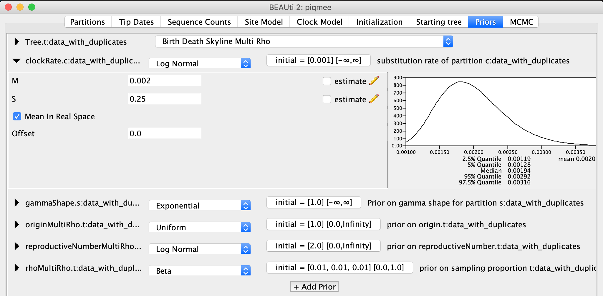
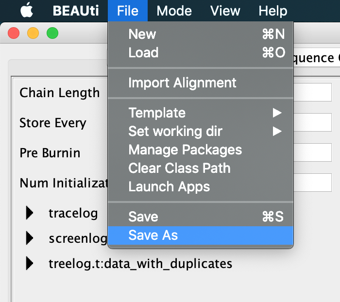
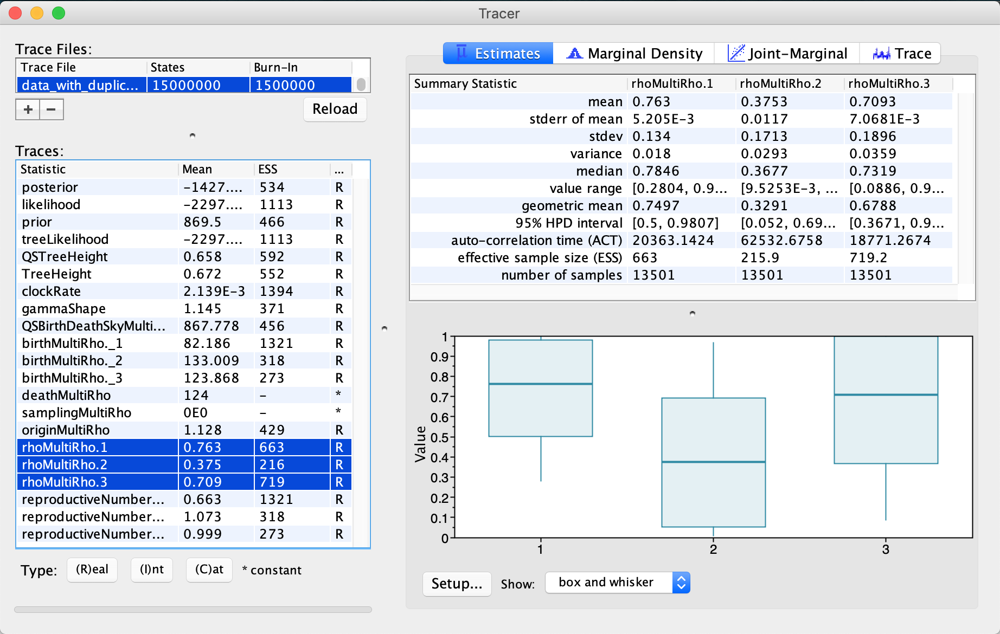

# Background

In a usual Bayesian phylodynamic analysis only a few hundred sequences can be input and successfully processed within a reasonable runtime.
Data sets containing thousands of sequences are usually impossible to be analysed.
Down-sampling the data set at random is an option, but leads to imprecise parameter estimates and could lead to underestimation of the time of the most recent common ancestor.

Many data sets however contain duplicates.
This is especially the case for longitudinally sampled sequences from one host infected by a pathogen causing a chronic infection, or for sequences obtained from multiple individuals infected by a slowly mutating pathogen.
One could take advantage of this duplicity to reduce the analysis runtime and thus allow large data sets to be analyzed.

The fact that a certain sequence is seen in multiple copies in the resulting sequence alignment is informative for the tree prior model and thus helps to narrow down the parameters of the population dynamic process.
However, these duplicates do not contain information for their confident placing in a phylogenetic tree (resulting in poorly supported bifurcations).
Sampling from all possible topological configurations during the MCMC thus represents a waste of computational time.
A new package for BEAST 2, called PIQMEE, draws information from these duplicates for population dynamic inference (under the birth-death model) without inferring the full topologies of duplicate sequences .
This approach reduces the complexity of analyses and enables datasets as large as 20000 sequences (~20 unique, rest being duplicates) to be processed within a 10-day runtime.


----

# Programs used in this Exercise

### BEAST2 - Bayesian Evolutionary Analysis Sampling Trees 2

BEAST2 is a free software package for Bayesian evolutionary analysis of molecular sequences using MCMC and strictly oriented toward inference using rooted, time-measured phylogenetic trees .
This tutorial uses the BEAST2 version {{ page.beastversion }}.

### BEAUti2 - Bayesian Evolutionary Analysis Utility

BEAUti2 is a graphical user interface tool for generating BEAST2 XML configuration files.

Both BEAST2 and BEAUti2 are Java programs, which means that the exact same code runs on all platforms.
For us it simply means that the interface will be the same on all platforms.
The screenshots used in this tutorial are taken on a Mac OS X computer; however, both programs will have the same layout and functionality on both Windows and Linux.
BEAUti2 is provided as a part of the BEAST2 package so you do not need to install it separately.

### Tracer

Tracer ([http://beast.community/tracer](http://beast.community/tracer)) is used to summarize the posterior estimates of the various parameters sampled by the Markov Chain.
This program can be used for visual inspection and to assess convergence.
It helps to quickly view median estimates and 95% highest posterior density intervals of the parameters, and calculates the effective sample sizes (ESS) of parameters.
It can also be used to investigate potential parameter correlations.
We will be using Tracer v{{ page.tracerversion }}.

### R / RStudio

We will be using R to analyze the output of the Birth-Death Skyline plot.
RStudio provides a user-friendly graphical user interface to R that makes it easier to edit and run scripts.
(It is not necessary to use RStudio for this tutorial).

----

# Practical: Analysing a simulated data set with PIQMEE

The aim of this tutorial is to become familiar with setting up the analyses with PIQMEE and with the subsequent analysis of the output.
We will demonstrate how to use the PIQMEE package by applying it a simulated data set of 150 sequences sampled longitudinally mimicking a situation where a pathogen population from an infected patient gets sampled and sequenced at 3 distinct time points.

## The Data

The data set used in this tutorial consists of 150 sequences in total, of which only 20 are unique.
Note that since PIQMEE cannot handle recombining sequences, the sequences were simulated without recombination.

When preparing the alignment file for BEAUti one needs to keep in mind that we will need to somehow tell PIQMEE (and thus BEAUti) about the number of copies, as well as the sampling times, of each unique sequence.
This specification can be done directly in the sequence annotation of the alignment file or can be later input manually in BEAUti.
In either case, both the sequence sampling times and the number of copies will each have to be specified as a *single number, not a vector*.
Therefore, if there are unique sequences in the data set that have been sampled at multiple time points (dates), we need to be able to specify this in our alignment, such that it can later be processed correctly by BEAUti.
We will now describe two ways to make this specification for such data sets.

**Option 1**: The first and simpler way is to represent each copy of each unique sequence as a separate entry in the alignment.
This means that each unique sequence will appear in the alignment (fasta file) as many times as is the number of its total copies.
Sampling time point has to specified accordingly for each sequence and the number of total copies has to be set to 1 either in the sequence annotation directly in the alignment file, or will be input later in BEAUti manually.
However, if the data set is large, specifying the number of copies in this way may cause BEAST to use too much memory when reading in the xml file, and thus lead to initialization errors.

**Option 2**: The second and recommended way is to de-duplicate repetitive sequences per each time point.
In other words, each unique sequence will appear in the alignment (fasta file) as many times as there are different sampling times associated with that sequence.
Each instance of that sequence in the alignment has to be assigned one sampling time and the number of copies of that sequence is set to its observed count at that particular time point.

The data used in this tutorial contain several unique sequences, of which one is associated with multiple sampling time points.
We de-duplicated the sequences according to *Option 2* described above, and thus obtained an alignment of 21 sequences, 1500 nucleotides each.
We specified the sampling dates and number of copies of each sequence in the sequence annotation.
<!-- The number of copies here represents the number of reads that have been obtained for each sequence at that particular time point. -->
You can check out this annotation by opening the alignment file in a text editor.
The alignment can be downloaded as part of this tutorial (data_with_duplicates.fasta).

> **Downloading from taming-the-beast.org**
>
> Link to the alignment file, `data_with_duplicates.fasta` is on the left-hand panel, under the heading **Data**.
> **Right-click** on the link and select **"Save Link As..."** (Firefox and Chrome) or **"Download Linked File As..."** (Safari) and save the file to a convenient location on your local drive.
> Alternatively, if you **left-click** on the link most browsers will display the alignment file.
You can then press **File > Save As** to store a local copy of the file.
Note that some browsers will inject an HTML header into the file, which will make it unusable in BEAST2 (making this the less preferable option for downloading data files).
>


## Creating the analysis file with BEAUti

### Installing PIQMEE

To use the PIQMEE package within BEAUti2 or BEAST2, we first need to download it. To do so, open BEAUti and click on `File >> Manage Packages`, select PIQMEE and then hit the `Install/Upgrade` button.

<figure>
    <a id="fig:packagemanager"></a>
    
    <figcaption>Figure 1: Opening up the Package Manager in BEAUti</figcaption>
</figure>
<br>

<figure>
    <a id="fig:download"></a>
    
    <figcaption>Figure 2: Installing PIQMEE with BEAUti</figcaption>
</figure>
<br>  

Downloading PIQMEE will automatically trigger the download of BDSKY  as well, if not installed already, since PIQMEE's tree prior is based on the birth-death skyline model implemented in BDSKY.

Now you need to restart BEAUti for the installed packages to load up properly.

### Loading PIQMEE template

By default, BEAUti loads the standard template for setting up xml files. However, setting up analysis with PIQME requires a few additional input tabs (for duplicate counts for instance).
Thus, we need to change to piqmee template instead.

>
> Click on `File >> Template` and select _piqmee_ from the given options.
>

<figure>
    <a id="fig:template"></a>
    
    <figcaption>Figure 3: Switching to PIQMEE template </figcaption>
</figure>
<br>

### Importing alignment

Now we can continue setting up the xml as usual.
Drag and drop, or input the data file `data_with_duplicates.fasta` via `File >> Import Alignment` option and navigating to the location of the fasta file.

<figure>
    <a id="fig:alignmentimport"></a>
    
    <figcaption>Figure 4: Importing alignment </figcaption>
</figure>
<br>

When prompted, confirm that the data are `nucleotide` sequences.

<figure>
    <a id="fig:alignmentimportnucleotide"></a>
    
    <figcaption>Figure 5: Specifying that the alignment contains nucleotide sequences </figcaption>
</figure>
<br>

After you have loaded the fasta file in BEAUti, you can see that the alignment contains 21 sequences, as described above.

<figure>
    <a id="fig:alignmentimported"></a>
    
    <figcaption>Figure 6: Visulization of imported alignment in BEAUti </figcaption>
</figure>
<br>

### Setting up the sampling times
Since our data set contain longitudinally sampled sequences, we need to extract the sampling times for each sequence in order to correctly analyze this data.

>
> Click on **Tip Dates** tab and tick the option `Use tip dates`.
>

The date that specifies the sampling time associated with the given sequence is contained in the sequence annotation.

>
> Click on the **Auto Configure** button.
> Here, select `split on character` option.
The default character to split the string on is the underscore `_`.
This is exactly the separator character used in our sequence annotation, and so we leave it to the default.
Then, specify that we are interested in the `3`<sup>rd</sup> character group.
>

<figure>
    <a id="fig:dates"></a>
    
    <figcaption>Figure 7: Specifying tip dates </figcaption>
</figure>
<br>

Since we have simulated data, the date is in arbitrary time units.
However, due to the fact that our data set has been simulated such as to mimic within-host pathogen data, the realistic time unit would be years post-infection.
Specifying the time unit for the sampling times automatically provides the unit for the molecular clock.
So, since we selected the unit for the tip dates in years, we would have the substitution rate in units of substitutions/site/year.


### Specifying the number of copies of each sequence
As mentioned earlier, our alignment has been de-duplicated such that we only have unique sequences per each time point.
However, since each sequence has been observed in multiple copies and we want to account for this in our analysis, we need to inform our method where it can get this count information from.

>
> Change to the **Sequence Counts** tab.
> Click on the **Guess** button and select `use everything`, specifying that you want to select field which follows `after last _`.
>

<figure>
    <a id="fig:counts"></a>
    
    <figcaption>Figure 8: Specifying observed counts of each sequence </figcaption>
</figure>
<br>

**Side note**: If the duplicate sequences were specified as separate entries in the alignment (Option 1 described in the *Data* section), we would have left the **Sequence Counts** tab settings unchanged, i.e. we would have specified that each sequence in the alignment has been observed exactly once.
When running this alignment with PIQMEE in BEAST, the software would automatically group identical sequences together and de-duplicate them internally.

### Specifying the Site Model
In the **Site Model** tab, specify that we assume the `Gamma Category Count` to be `4` and leave all the other option to the default.

<figure>
    <a id="fig:sitemodel"></a>
    
    <figcaption>Figure 9: Specifying site model settings </figcaption>
</figure>
<br>

### Specifying the Clock Model
Toggle to the `Clock Model` tab.
We keep the *Strict Clock* model but we change (the starting value of) the clock rate from 1 to `0.001`, units being is substitutions/site/year.

<figure>
    <a id="fig:clockmodel"></a>
    
    <figcaption>Figure 10: Setting up the clock model </figcaption>
</figure>
<br>

### Specifying Priors
Now we need to specify the tree prior and the prior distribution for the parameters of our models.
For the tree prior, we would like to use a model that takes into account the fact that our sequences have been sampled at several points in time.
In fact, there have been three points in time where intense sampling happened.
At each time point many sequences were obtained at once.
This is due to the type of the data we are dealing with - sequences have been simulated to mimic a chronically infected patient and the pathogen population from within this patient has been sampled and sequenced at various time points.
If we look back at the **Tip Dates** tab, we can spot these 3 time points.

<figure>
    <a id="fig:samplingtimepoints2"></a>
    
    <figcaption>Figure 11: The three distinct sampling times in our data set (0, 0.25, 0.5) are highlighted </figcaption>
</figure>
<br>

The tree prior in PIQMEE has been implemented as a birth-death skyline model.
A specific type of this model allows for "mass sampling" events and assumes that the sampling proportion `rho` is different for each such period of intense sampling.
This is exactly the model that fits our data and we thus select it for the analysis.

>
>In the **Priors** tab, select as the tree prior the `Birth-death skyline Multi Rho` model.
>

<figure>
    <a id="fig:treeprior"></a>
    
    <figcaption>Figure 12: Setting up the tree prior</figcaption>
</figure>
<br>

We will now specify when exactly did the intense sampling happen.
These times correspond to the tip times we have just looked at a moment ago.
They are specified as `Height`, i.e. time since the last sample.
These times are 0, 0.25 and 0.5, meaning, we sequenced the pathogen population from the patient at some point corresponding to 0, then 3 months earlier (height 0.25) and 6 months earlier (height 0.5).

>
> **Setting up the sampling proportion changes for BDSKY model**
>
>Go to the **Initialization** tab and expand the `rhoChangeTimes` entry by clicking on the arrow to the left.
Change the `Dimension` to `3`.
Then copy the _unique `Height` values_ you saw in the **Tip Dates** tab and input them as `Value` of the `rhoChangeTimes`.
>

<figure>
    <a id="fig:rhosamplingchangetimes"></a>
    
    <figcaption>Figure 13: Setting up the rho change times</figcaption>
</figure>
<br>

Back in the **Priors** tab, we can now specify the actual prior distributions for the parameters.
For the selected birth-death model, we have to specify a prior for the death (become uninfectious) rate, the reproductive number, the sampling proportion rho and the origin time of the tree.
The first three parameters are correlated, meaning, that without fixing one, or without having very strong priors, we cannot get a good estimate of each parameter.

Usually, one has no or very little knowledge about the values for the sampling proportion and the birth rate (the duplication rate of the pathogen) and thus very little idea about the reproductive number (=birth rate / death rate).
However, for most pathogens, a good estimate (from previous studies) about the death rate is available.
This then allows for fixing or using a narrow prior for the death rate parameter.

For this tutorial, we will fix the death (become uninfectious) rate parameter.
As we have simulated the data we know its value exactly.

>
> Click on the arrow to the left of `becomeUninfectiousRate` to expand the parameter prior settings.
Click on the tab with the initial values.
A pop-up window will show up.
In this pop-up window, set the `Value` to `124`.
Then, untick the `Estimate` box and hit _OK_.
>
>Note that once you untick the Estimate box and click OK, the entry for become uninfectious rate will disappear immediately from the Priors tab and you will not be able to change this settings any longer, unless you start the whole process of setting up the xml in BEAUti from scratch.
>

<figure>
    <a id="fig:deathrate"></a>
    
    <figcaption>Figure 14: Setting up the death (becomeUninfectious) rate</figcaption>
</figure>
<br>

For the reproductive number and the sampling proportion rho, we will set quite broad priors.

>
>Expand the `reproductiveNumber` entry.
Leave the prior distribution to the default Log Normal, but tick the box next to the `Mean In Real Space` option and `set both M and S to 1.0`.
Then, click on the initial value tab and change the `Dimension` to `3`.
Confirm the setting by clicking _OK_.
>

<figure>
    <a id="fig:R0"></a>
    
    <figcaption>Figure 15: Setting up the reproductive number prior</figcaption>
</figure>
<br>

>
> Now expand the `rhoMultiRho` entry.
Again, keep the prior distribution to the default Beta.
Click on the initial value tab and change the `Dimension` to `3`.
Then, we input the vector of starting values for the rho parameter `0.01 0.01 0.01` as the `Value`.
>

<figure>
    <a id="fig:rhoprior"></a>
    
    <figcaption>Figure 16: Setting up rho</figcaption>
</figure>
<br>

The last parameter relevant to the tree prior for which we need to set the prior distribution is the origin.
We will set a uniform prior for this parameter between 0 and 2 and the initial value to 1.

>
>Expand the `origin` entry.
Change `Upper` bound to `2`.
Then click on the initial value tab to expand it.
Change the (starting) `Value` to `1`.
>

<figure>
    <a id="fig:origin"></a>
    
    <figcaption>Figure 17: Setting up the origin prior</figcaption>
</figure>
<br>

To make sure that the initialization of the tree when running BEAST will go smoothly, we have to make sure that the first built tree fits with our requirement of the origin height being 1, i.e. the tree height has to be less than 1.
To achieve this, we can tell BEAST to scale the first proposed tree such that it follows this requirement.
We set this up in the "Starting Tree panel", which it hidden at first.
To make it visible, click on `View >> Show Starting tree panel`.

<figure>
    <a id="fig:startintreepanel"></a>
    
    <figcaption>Figure 18: Viewing starting tree panel</figcaption>
</figure>
<br>

A new tab will become visible, where we can see that the first tree will be a random coalescent tree with population size 1.0.
We leave everything to the default but set the maximum root height to 0.99.

>
>In the **Starting tree** panel, next to the `Root Heigh`, type in `0.99`.
>

<figure>
    <a id="fig:treerootheigh"></a>
    
    <figcaption>Figure 19: Making sure the initial tree height is smaller than the origin height</figcaption>
</figure>
<br>

Lastly, we will set the prior for the clock rate.
Again, we have some information about the clock rate.
We have simulated the data such as to mimic within-host pathogen evolution.
Namely, we tried to mimic HIV, and so we set the substitution rate on the order of 10<sup>-3</sup> substitutions/site/year.
Let our prior on the clock rate reflect this.

>
> Back in the **Priors** tab, expand the `clockRate` entry.
Change the distribution from _Uniform_ to `Log Normal`.
Change `M to 0.002 and S to 0.25`.
Also, check the box next to `Mean In Real Space`.
>

<figure>
    <a id="fig:clock"></a>
    
    <figcaption>Figure 20: Setting up the clock rate prior</figcaption>
</figure>
<br>

For the gammaShape parameter we leave the prior settings to the default.

### Specifying Chain Length
In the **MCMC** tab, inspect the settings.
Change the `Chain Length` to 15,000,000.
This is a reasonable chain length for the size of our data set and the number of parameters we need to estimate.
We leave everything else set to the default.

<figure>
    <a id="fig:chainlength"></a>
    
    <figcaption>Figure 21: Setting up the chain length</figcaption>
</figure>
<br>

We have now finished the xml set up.
Save the xml by clicking on `File >> Save as` in BEAUti navigation panel and name the file `data_with_duplicates.xml`.

<figure>
    <a id="fig:savexml"></a>
    
    <figcaption>Figure 22: Saving the xml file</figcaption>
</figure>
<br>

## Run the xml
We are now ready to run the xml in `BEAST`.
Open the `BEAST2` application and input the xml.
_Optional_: If you want to obtain exactly the same results as we did for this tutorial, set the Random number seed to 1.

<figure>
    <a id="fig:beast"></a>
    
    <figcaption>Figure 23: Running xml with BEAST</figcaption>
</figure>
<br>

The analysis will take around 15-20 minutes.
If you do not have the time to wait for it to finish, in `precooked_runs`, we provide an example output that you can use for the rest of this tutorial.

## Inspect the run in Tracer
When inspecting the `*.log` file in tracer, we find that all parameters mixed (ESS>200).
Though, some parameters, such as the "rhoMultiRho.2" (which is the sampling proportion estimate for the second mass sampling, i.e. 3 months before the last sample), just barely made it past the 200 ESS boundary.

By selecting and comparing estimates for the three sampling proportions, we also see that the sampling proportion for the second time point is lower than for the other two sampling points - the median being 0.78 for the first (at height 0.5), 0.37 for the second (at height 0.25), and 0.73 for the last (at height 0.0) sampling time point, respectively.
These estimates are very close to the true values; the actual values (from simulation) being 0.91, 0.2 and 1.

<figure>
	<a id="fig:tracer"></a>
	
	<figcaption>Figure 24: Checking the values of sampling proportion rho in Tracer</figcaption>
</figure>
<br>

We can also check the other parameters and their estimates in Tracer.
The median tree height, for instance, is 0.65 years, corresponding to around 8 months and the maximum tree height is 1.66 years.
The median clock rate estimate is 2x10<sup>-3</sup> substitutions/site/year.

Let us now have a detailed look at the effective reproductive number (R<sub>e</sub>), a quantity of great interest for epidemiologist.
Looking at the estimates for R<sub>e</sub> directly in Tracer can be confusing.
Tracer does not necessarily give us a clear picture of the changes in the reproductive number over time.
This is due to the fact that the lengths of intervals for which these estimates are obtained vary during MCMC sampling in BEAST, since trees with different origin values are considered (for details of how skyline models work, refer to the _Skyline plots_ tutorial).

To properly look at the R<sub>e</sub> estimate's changes over time, we have to use a custom script to properly vizualize it.

## Plotting the reproductive number with R

We will plot the R<sub>e</sub> estimate's changes over time using R.
Namely, we will use the R-package `bdskytools`.
It is not available over CRAN, so (if not installed yet) we need to get the package from the GitHub:

```{R}
install.packages("devtools")
library(devtools)

devtools::install_github("laduplessis/bdskytools")
```
If you have the package downloaded and installed, we can now load it into our R workspace.

```{R}
library(bdskytools)
```

Now, we need to navigate to the directory with the `*.log` file of our PIQMEE analysis run and tell R what is the file we want to analyze.

```{R}
# Navigate to Session > Set Working Directory > Choose Directory
#  (if using RStudio)
# or set fname to the full path to the log file
fname <- "data_with_duplicates.data_with_duplicates.log"   
lf    <- readLogfile(fname, burnin=0.1)
```

Notice that we directly discarded first 10% of our chain as burn-in.

Next, we want to smoothen R<sub>e</sub> estimates over a regular (not arbitrary, i.e. based on tree's origin) time grid.
We will use a grid with many more points than the three skyline intervals used in BEAST run.

```{R}
# time period covered by the grid starts at present (0) and
#   goes back into the past until 1.7 years before present
#   (remember that the maximum tree height we observed in our estimates
#    was 1.66, so rounded 1.7 years)
timegrid       <- seq(0,1.7,length.out=101)
```

Next, we can extract log entries for the R<sub>e</sub> and smoothen over a regular (not arbitrary, based on tree's origin) time grid.
We will then calculate median estimate and the highest posterior density (HPD) interval for R<sub>e</sub> for each grid point.


```R
# extracting the relevant columns from the log file
Re_sky    <- getSkylineSubset(lf, "reproductiveNumber")
# calculating the actual R<sub>e</sub> values and HPDs
#    for each time grid point and each entry in our log file
Re_gridded     <- gridSkyline(Re_sky, lf$origin, timegrid)
Re_gridded_hpd <- getMatrixHPD(Re_gridded)
```

Now we are ready to plot the smooth skyline:

```R
times <- 0-timegrid
plotSkyline(times, Re_gridded_hpd, type='smooth', xlab="Time (Years)", ylab=expression("R"[e]))
abline(h = 1, col="red")
```

<figure>
	<a id="fig:bdsky_smooth"></a>
	
	<figcaption>Figure 25: The smooth R<sub>e</sub> skyline.</figcaption>
</figure>
<br>

We can see from the figure above that the R<sub>e</sub> was always around 1, but there seems to have been a time period (0.3-0.6 years before present, so 3.5-7 months before the last sample) where it was rather close to 1.1.

----

# Useful Links

- [Bayesian Evolutionary Analysis with BEAST 2](http://www.beast2.org/book.html) 
- BEAST 2 website and documentation: [http://www.beast2.org/](http://www.beast2.org/)
- BEAST 1 website and documentation: [http://beast.bio.ed.ac.uk](http://beast.bio.ed.ac.uk)
- Join the BEAST user discussion: [http://groups.google.com/group/beast-users](http://groups.google.com/group/beast-users)

----

# Relevant References


